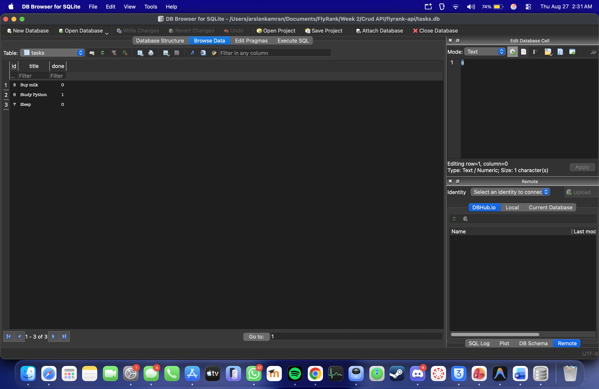

# FlyRank Task API — v2 (SQLite)

A CRUD API that manages a to-do list, now backed by a real **SQLite database**.  
Built with Python and FastAPI. Data survives server restarts.

---

## Why SQLite?

SQLite was chosen because it is a **single-file, zero-configuration database** —
the entire database lives in one file (`tasks.db`) on disk with no separate server
to install or run. That single change — swapping the in-memory list for a file on
disk — is what makes the data persist after every restart. It is the right tool for
a project of this size: fast, free, and needs nothing extra.

---

## How to Run

Copy and run these commands in order:

```bash
python3 -m venv venv
source venv/bin/activate
pip install fastapi uvicorn pydantic
uvicorn main:app --reload
```

The server starts at **http://localhost:8000**.  
`tasks.db` is created automatically on the first run — no manual setup needed.  
Three example tasks are seeded automatically, but only once (restarting will not duplicate them).

---

## Endpoints

| CRUD Operation | HTTP Method | Endpoint           | Description             |
|----------------|-------------|--------------------|-------------------------|
| Read           | GET         | `/`                | API information         |
| Read           | GET         | `/health`          | Server health check     |
| Read           | GET         | `/tasks`           | List all tasks          |
| Create         | POST        | `/tasks`           | Add a new task          |
| Read           | GET         | `/tasks/{task_id}` | Get a specific task     |
| Update         | PUT         | `/tasks/{task_id}` | Update a specific task  |
| Delete         | DELETE      | `/tasks/{task_id}` | Remove a specific task  |

---

## Status Codes

| Code | Meaning         | When                              |
|------|-----------------|-----------------------------------|
| 200  | OK              | GET / PUT success                 |
| 201  | Created         | POST success                      |
| 204  | No Content      | DELETE success                    |
| 400  | Bad Request     | Missing or empty title            |
| 404  | Not Found       | Task ID does not exist            |

---

## Database

The database file is `tasks.db` and is created automatically when the server first starts.  
It is git-ignored so that each fresh clone starts with its own clean database.

### Database location
```
flyrank-api/
└── tasks.db   ← created automatically, do not commit this file
```

### Schema
```sql
CREATE TABLE tasks (
    id    INTEGER PRIMARY KEY AUTOINCREMENT,
    title TEXT    NOT NULL,
    done  INTEGER NOT NULL DEFAULT 0
);
```

---

## DB Browser Screenshot

The tasks table open in DB Browser for SQLite, showing the id, title, and done columns:



---

## Example SQL Query (Stage 4)

This query was run directly in DB Browser to mark every task as completed:

```sql
UPDATE tasks SET done = 1;
```

After running this query and clicking "Write Changes", hitting `GET /tasks` from the API
immediately returned all tasks with `"done": 1` — no server restart needed.
This proved there is **one source of truth**: the API and DB Browser both read the exact same file.

---

## Example curl Commands

```bash
# List all tasks
curl http://localhost:8000/tasks

# Create a task
curl -X POST http://localhost:8000/tasks \
  -H "Content-Type: application/json" \
  -d '{"title": "Buy milk", "done": false}'

# Update a task
curl -X PUT http://localhost:8000/tasks/1 \
  -H "Content-Type: application/json" \
  -d '{"title": "Buy milk", "done": true}'

# Delete a task
curl -X DELETE http://localhost:8000/tasks/1
```